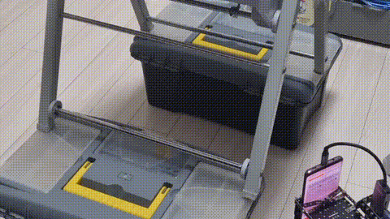

# ATRover

A real-time rover control platform for Android-based rover clients. The system enables remote operators to control rovers via a web dashboard while receiving live video and audio feeds.




## Architecture Overview

```
 ┌─────────────────────────────────────────────────────────────────┐ 
 │                          Web Dashboard                          │ 
 └─────────────────────────────────────────────────────────────────┘ 
                                                                     
 ┌─────────────────────────────────────────────────────────────────┐ 
 │                        Atrover-backend                          │ 
 │                                                                 │ 
 │     ┌────────────────────┐    ┌────────────────────────────┐    │ 
 │     │   Command Server   │    │                            │    │ 
 │     └─────────┬──────────┘    │     Media Server Cluser    │    │ 
 │               │               │           (x N)            │    │ 
 │               │               │                            │    │ 
 │               │               │     ┌───────────────┐      │    │ 
 │               │               │     │  Media Server │      │    │ 
 │               │               │     └───────────────┘      │    │ 
 │               │               │     ┌───────────────┐      │    │ 
 │               │               │     │  Media Server │      │    │ 
 │               │               │     └───────────────┘      │    │ 
 │               │               │          ┌─────┐           │    │ 
 │               │               │          │ ... │           │    │ 
 │               │               │          └─────┘           │    │ 
 │               │               └─────────────┬──────────────┘    │ 
 │               │                             │                   │ 
 │               └──────────────┬──────────────┘                   │ 
 │                   ┌──────────┴────────────┐                     │ 
 │                   │        Database       │                     │ 
 │                   │                       │                     │ 
 │                   │     ┌───────────┐     │                     │ 
 │                   │     │  Session  │     │                     │ 
 │                   │     └───────────┘     │                     │ 
 │                   │     ┌───────────┐     │                     │ 
 │                   │     │  Pub/Sub  │     │                     │ 
 │                   │     └───────────┘     │                     │ 
 │                   └───────────────────────┘                     │ 
 └─────────────────────────────────────────────────────────────────┘ 
 ┌─────────────────────────────────────────────────────────────────┐ 
 │                         Atrover-client                          │ 
 │                                                                 │ 
 │                    ┌─────────────────────┐                      │ 
 │                    │    Android-client   │                      │ 
 │                    └─────────────────────┘                      │ 
 │                    ┌─────────────────────┐                      │ 
 │                    │   Arduino-firmware  │                      │ 
 │                    └─────────────────────┘                      │ 
 └─────────────────────────────────────────────────────────────────┘ 
```

## Repositories

### [atrover-backend](https://github.com/backyard-developers/atrover-backend)

Real-time WebSocket backend server for rover command routing and media streaming.

**Tech Stack:** TypeScript, Node.js, Redis

---

### [atrover-client](https://github.com/backyard-developers/atrover-client)

Android application for controlling a rover based on Arduino via USB serial.

**Tech Stack:** Kotlin, Jetpack Compose, CameraX, WebRTC
